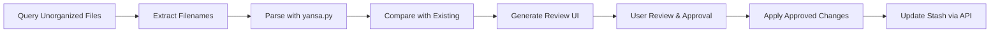

# Stash Plugin – Automated Metadata Enrichment (Vision & Phase 1 Scope)

## Overview

This document outlines the vision, scope, and first implementation phase of a Stash plugin designed to help users automatically enrich metadata for unorganized files using Stash's API. The plugin serves as an automation-assist tool that intelligently parses filenames to populate missing metadata fields while preserving existing data and requiring user review before finalizing changes.

## Core Purpose

The plugin addresses a common challenge in media management: unorganized files with meaningful information trapped in their filenames. By extracting this information and mapping it to structured metadata fields, the plugin reduces manual data entry while maintaining user control over the final result.

## First Version Scope: Initial Metadata Surface

The first iteration of the plugin is intentionally focused and limited to ensure reliability and user trust. It will only attempt to parse and populate the following four metadata fields:

1. **Studio** - The production studio or distributor
2. **Title** - The scene title or description
3. **Date** - Release or production date
4. **Studio Code** - Internal studio identifier or scene code

This focused approach allows us to validate the core parsing workflow while minimizing risk to existing metadata.

### Field Population Rules

For each of these fields, the plugin follows strict rules:

- **If a field already has a value in Stash**: The plugin will not overwrite it under any circumstances
- **If a field is empty**: The plugin will attempt to populate it based on filename parsing
- **Multiple missing fields**: The plugin may populate several missing fields for the same file
- **Partial success**: Some fields may be populated while others remain empty if parsing is uncertain

This conservative approach ensures the plugin is additive rather than destructive.

## Filename Parsing Philosophy

### Understanding Filename Complexity

Filenames in adult media collections often contain overlapping or ambiguous information that requires careful interpretation. The same filename might include:

- Studio names with various abbreviations
- Date formats in multiple styles
- Scene codes with inconsistent patterns
- Title information mixed with other metadata

### Progressive Component Extraction

The parsing process follows a progressive removal approach:

1. **Identify known components** (studio, code, date) with high confidence
2. **Remove these components** from the filename string
3. **Analyze the residual string** to infer the title
4. **Handle ambiguity** by deferring uncertain extractions

This approach acknowledges that title parsing is inherently dependent on what other components are successfully extracted first. If studio identification fails, the remaining "title" extraction may be polluted with studio name fragments.

### Embracing Imperfect Data

Early versions of the plugin do not attempt to solve all ambiguity:

- **Ambiguous dates** may be left uninterpreted rather than risk incorrect values
- **Multiple possible studios** result in no studio selection rather than guessing
- **Conflicting patterns** are flagged for user review rather than auto-resolved

This pragmatic approach prioritizes accuracy over completeness.

## Automation Model

### Conceptual Workflow

The plugin operates as a non-destructive, additive workflow with these conceptual steps:

1. **Discovery**: Query unorganized files via the Stash API
2. **Analysis**: For each file:
   - Read existing metadata from Stash
   - Parse filename to infer possible metadata values
   - Compare inferred values with existing values
   - Generate recommendations for missing fields only
3. **Presentation**: Display side-by-side comparison of original vs. suggested metadata
4. **Review**: Allow user to approve, reject, or modify individual field suggestions
5. **Application**: Write only approved changes back to the database via the API
6. **Preservation**: Leave files marked as unorganized so users can review changes manually

### Non-Destructive Design Principles

The automation model is built around these core principles:

- **Never overwrite existing metadata** - Only populate empty fields
- **Require explicit approval** - No changes are applied without user consent
- **Maintain unorganized status** - Files remain marked for manual review
- **Provide full transparency** - Users see exactly what will change before approval

This design ensures users maintain complete control while benefiting from automated suggestions.

## User Interface Design

### Simplified One-Click Automation

While the plugin maintains comprehensive review capabilities for transparency and safety, the primary interface is designed for maximum simplicity and automation:

**Plugin Tab Integration**: The plugin appears in Stash's plugins section with a minimal, clean interface featuring:

- **Single "Run Enrichment" Button**: Prominently displayed button that initiates the full enrichment process
- **Progress Indicator**: Real-time feedback showing processing status and results
- **Summary Statistics**: Clear display of changes made after completion
- **Settings Toggle**: Optional configuration for advanced users

### Automated Workflow Experience

When users click the "Run Enrichment" button, the plugin executes the full workflow automatically:

1. **Silent Discovery**: Query unorganized files without user intervention
2. **Background Processing**: Parse filenames and compare with existing metadata
3. **Smart Application**: Apply only high-confidence changes automatically
4. **Conservative Approach**: Leave uncertain or conflicting data for manual review
5. **Clear Reporting**: Display summary of changes made and items requiring attention

### Progressive Disclosure Interface

The interface follows a progressive disclosure model:

- **Default View**: Minimal information with single action button
- **Expanded View**: Detailed logs and statistics for interested users
- **Advanced Options**: Configuration settings for power users
- **Manual Review**: Access to detailed review interface for edge cases

This design ensures the plugin is immediately useful for casual users while providing depth for those who want more control or visibility into the process.

## Design Principles

### 1. Non-Destructive Behavior

The plugin must never overwrite existing metadata, regardless of confidence in the parsed data. Existing values are always preserved, and the plugin only populates truly empty fields.

### 2. Transparency

Users can review exactly what changes are being proposed before they're applied. The interface clearly shows:
- Original values (including empty fields)
- Suggested new values
- Confidence indicators for each suggestion
- Side-by-side comparisons

### 3. Incremental Enrichment

The plugin focuses on gradual improvement rather than one-shot organization. Each run may fill in additional missing fields, progressively improving metadata completeness over multiple passes.

### 4. Iteration-Friendly Design

The architecture supports future parsing layers and enhancements. New extraction capabilities can be added without disrupting existing functionality.

### 5. Respect for Imperfect Data

The system acknowledges that filenames are messy and often incomplete. Rather than forcing matches, the plugin gracefully handles:
- Missing information
- Inconsistent patterns
- Ambiguous formatting
- Conflicting signals

## Technical Architecture

### Core Components

1. **Stash API Client** - Handles authentication, queries, and updates
2. **Filename Parser** - Integrates with existing yansa.py parsing pipeline
3. **Metadata Comparator** - Compares parsed results with existing metadata
4. **Review Interface** - Generates UI for user review and approval
5. **Batch Processor** - Applies approved changes efficiently

### Data Flow

## Future Directions

### Phase 2 Enhancements

After validating the core approach, future iterations could include:

1. **Additional Metadata Fields**
   - Performer names
   - Tags and categories
   - Scene descriptions
   - Image URLs

2. **Sophisticated Title Reconstruction**
   - Contextual title parsing based on studio patterns
   - Language detection and normalization
   - Special character handling

3. **Confidence Scoring**
   - Numerical confidence indicators for each field
   - User-configurable confidence thresholds
   - Automatic approval for high-confidence matches

4. **Optional Organization Marking**
   - User-configurable option to mark files as organized
   - Selective organization based on completeness thresholds
   - Staged organization workflows

5. **User-Configurable Parsing Behavior**
   - Studio-specific parsing rules
   - Custom pattern definitions
   - User feedback integration for learning

### Advanced Features

Long-term possibilities include:

- **Machine Learning Integration**: Train models on user-approved changes
- **Batch Processing Workflows**: Process entire collections with minimal intervention
- **API Extensions**: Support for additional media management systems
- **Performance Optimization**: Parallel processing for large collections

## Implementation Considerations

### Error Handling

The plugin must gracefully handle:
- Network connectivity issues
- API rate limiting
- Malformed filenames
- Authentication failures
- Unexpected data structures

### Performance

For large collections, the implementation should:
- Process files in configurable batch sizes
- Provide progress indicators
- Support resuming interrupted operations
- Cache parsing results where appropriate

### User Experience

The interface should:
- Require minimal clicks for common operations
- Provide keyboard shortcuts
- Support bulk approval/rejection operations
- Offer clear visual feedback for all actions

## Success Metrics

The plugin's success will be measured by:

1. **Accuracy**: Percentage of correctly populated fields
2. **Efficiency**: Time saved compared to manual data entry
3. **User Satisfaction**: Adoption rates and user feedback
4. **Reliability**: Low error rates and stable performance
5. **Safety**: Zero incidents of overwritten metadata

## Conclusion

This vision establishes a foundation for a metadata enrichment plugin that respects user control while providing meaningful automation. By starting with a focused scope and expanding based on user feedback, the plugin can evolve into an essential tool for media collection management.

The emphasis on non-destructive behavior, transparency, and incremental improvement ensures users can trust the plugin with their valuable metadata while benefiting from intelligent automation.