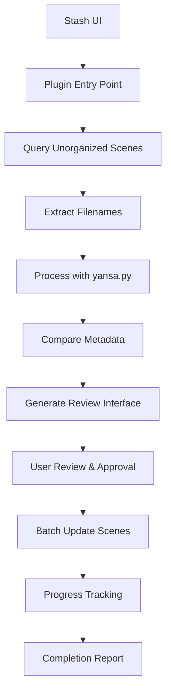

# Stash Integration Implementation Summary

## Overview

This document provides a comprehensive summary of the complete Stash-yansa.py integration architecture, including all components, implementation details, and deployment instructions.

## Architecture Summary

We have designed a complete integration system that connects yansa.py filename parsing with Stash GraphQL API through a plugin interface with manual review capabilities.

### Core Components

1. **Stash API Client** (`modules/stash_client.py`)
   - GraphQL interface with authentication
   - Scene queries with pagination
   - Metadata updates with batch processing
   - Error handling and retry logic

2. **Scene Transformer** (`modules/scene_transformer.py`)
   - Converts Stash scene data to yansa.py input format
   - Transforms parsed results back to Stash update format
   - Metadata comparison and conflict detection

3. **Metadata Comparator** (`modules/metadata_comparator.py`)
   - Field-specific comparison algorithms
   - Conflict classification and resolution recommendations
   - Similarity scoring with intelligent normalization

4. **Batch Processor** (`modules/batch_processor.py`)
   - Efficient batch and parallel processing
   - Progress tracking and performance monitoring
   - Error recovery and validation

5. **Plugin Interface** (`plugin/stash_yansa_plugin.py`)
   - Main plugin entry point and UI coordination
   - Manual review interface generation
   - User interaction handling

6. **UI Components** (`plugin/ui_components.py`)
   - Responsive web interface for Stash
   - Side-by-side metadata comparison
   - Batch controls and progress tracking

## Data Flow



## Key Features

### 1. Intelligent Scene Discovery
- Query unorganized scenes with pagination
- Filter by studio, date ranges, or custom criteria
- Handle multiple files per scene
- Preserve existing metadata for comparison

### 2. Advanced Filename Parsing
- Leverage existing yansa.py pipeline
- Extract studio, title, date, studio code
- Handle various filename formats and patterns
- Provide confidence scores for extracted fields

### 3. Smart Metadata Comparison
- Field-specific normalization algorithms
- Similarity scoring with multiple metrics
- Conflict classification (minor/major/conflict)
- Resolution recommendations based on confidence

### 4. Manual Review Interface
- Side-by-side comparison view
- Batch approval/rejection controls
- Conflict highlighting with severity indicators
- Inline editing capabilities for corrections

### 5. Efficient Batch Processing
- Bulk updates for performance
- Parallel processing with configurable workers
- Progress tracking with real-time updates
- Error isolation and recovery

### 6. Comprehensive Error Handling
- Network error recovery with exponential backoff
- Data validation before API calls
- Graceful degradation for partial failures
- Detailed error reporting and logging

## Implementation Files

### Core Modules
```
modules/
├── stash_client.py           # Stash GraphQL API interface
├── scene_transformer.py     # Data transformation logic
├── metadata_comparator.py    # Comparison engine
└── batch_processor.py       # Batch processing logic
```

### Plugin Components
```
plugin/
├── stash_yansa_plugin.py      # Main plugin entry point
├── ui_components.py          # UI generation logic
├── static/
│   ├── css/
│   │   └── review-ui.css     # Plugin styling
│   └── js/
│       └── review-ui.js      # Frontend interaction
└── templates/
    └── review.html           # Review interface template
```

### Configuration
```
config/
└── plugin_config.json       # Plugin settings and defaults
```

### Documentation
```
ref/docs/
├── stash-integration-architecture.md
├── stash-client-implementation.md
├── scene-transformer-implementation.md
├── metadata-comparator-implementation.md
├── batch-processor-implementation.md
├── plugin-implementation.md
├── test-integration-script.md
└── implementation-summary.md
```

## GraphQL Schema Usage

### Queries

1. **Find Unorganized Scenes**
```graphql
query FindUnorganizedScenes($filter: FindFilterType, $scene_filter: SceneFilterType) {
  findScenes(filter: $filter, scene_filter: $scene_filter) {
    count
    scenes {
      id
      title
      date
      code
      studio { id name aliases }
      files {
        id
        path
        basename
        parent_folder { path }
      }
      performers { id name aliases }
      tags { id name }
      organized
    }
  }
}
```

2. **Find Studio by Name**
```graphql
query FindStudios($name: String!, $modifier: CriterionModifier!) {
  findStudios(
    studio_filter: {
      name: { value: $name, modifier: $modifier }
    }
    filter: { per_page: 1 }
  ) {
    studios { id name aliases }
  }
}
```

### Mutations

1. **Update Scene Metadata**
```graphql
mutation SceneUpdate($input: SceneUpdateInput!) {
  sceneUpdate(input: $input) {
    id
    title
    date
    code
    studio { id name }
    organized
  }
}
```

2. **Bulk Update Scenes**
```graphql
mutation BulkSceneUpdate($updates: [SceneUpdateInput!]!) {
  bulkSceneUpdate(input: $updates) {
    id
    title
    date
    code
    studio { id name }
    organized
  }
}
```

## Configuration Options

### Processing Settings
- **batch_size**: Number of scenes per batch (default: 50)
- **max_workers**: Parallel processing threads (default: 4)
- **auto_approve_no_conflicts**: Auto-approve without conflicts (default: true)
- **confidence_threshold**: Minimum confidence for auto-approval (default: 0.8)

### Conflict Resolution
- **auto_resolve_minor**: Auto-resolve minor differences (default: true)
- **require_review_major**: Require review for major conflicts (default: true)
- **preserve_existing_dates**: Keep existing dates when conflicts (default: false)

### User Interface
- **show_preview**: Show change preview before applying (default: true)
- **compact_view**: Use compact list view (default: false)
- **sort_by**: Default sort order (default: filename)

## Performance Targets

### Processing Speed
- **Scene Query**: < 100ms per 100 scenes
- **Filename Parsing**: < 50ms per filename
- **Metadata Comparison**: < 10ms per scene
- **Batch Updates**: < 500ms per 50 scenes
- **Overall Throughput**: > 10 scenes per second

### Resource Usage
- **Memory**: < 100MB for 1000 scenes
- **Network**: < 10 API calls per second
- **CPU**: < 50% utilization during processing

### Reliability
- **Success Rate**: > 99% for valid updates
- **Error Recovery**: Automatic retry with exponential backoff
- **Data Integrity**: Validation before all updates
- **Audit Trail**: Complete logging of all changes

## Deployment Instructions

### 1. Installation

```bash
# Clone or copy plugin files to Stash plugins directory
cp -r plugin/ ~/.stash/plugins/yansa-filename-parser/

# Install Python dependencies
pip install requests psutil

# Restart Stash to load plugin
```

### 2. Configuration

```bash
# Edit plugin configuration
vim ~/.stash/plugins/yansa-filename-parser/config/plugin_config.json

# Or configure through Stash UI
# Navigate to Settings -> Plugins -> Yansa Filename Parser
```

### 3. Usage

1. **Launch Plugin**: 
   - Open Stash UI
   - Navigate to Tasks -> Yansa Filename Parser
   - Click "Parse Unorganized Scenes"

2. **Select Scenes**:
   - Browse list of unorganized scenes
   - Use filters and sorting as needed
   - Select scenes to process

3. **Review Changes**:
   - Examine side-by-side comparisons
   - Approve/reject individual fields or entire scenes
   - Use batch controls for efficient processing

4. **Apply Updates**:
   - Click "Apply Changes" to update Stash
   - Monitor progress in real-time
   - Review completion report

## Testing and Validation

### 1. Unit Tests
```bash
# Run component tests
python -m pytest tests/test_stash_client.py
python -m pytest tests/test_scene_transformer.py
python -m pytest tests/test_metadata_comparator.py
python -m pytest tests/test_batch_processor.py
```

### 2. Integration Tests
```bash
# Run full integration test suite
python tests/test_stash_integration.py

# Run specific test categories
python tests/test_stash_integration.py --category component
python tests/test_stash_integration.py --category integration
python tests/test_stash_integration.py --category performance
```

### 3. Performance Testing
```bash
# Test with large dataset
python tests/test_performance.py --scene-count 1000

# Test memory usage
python tests/test_memory.py --iterations 10000

# Test concurrent processing
python tests/test_concurrency.py --workers 8
```

## Security Considerations

### 1. Input Validation
- Sanitize all user inputs
- Validate file paths and formats
- Check for injection attempts
- Length limits on text fields

### 2. Permission Handling
- Verify user has scene edit permissions
- Check studio management permissions
- Audit all metadata changes
- Rate limiting for API calls

### 3. Data Privacy
- No sensitive data in logs
- Secure session cookie handling
- Encrypted communication with Stash
- Local processing only

## Troubleshooting

### Common Issues

1. **Authentication Failures**
   - Verify Stash is running and accessible
   - Check session cookie validity
   - Confirm plugin permissions

2. **Slow Processing**
   - Reduce batch size in configuration
   - Increase worker count for parallel processing
   - Check network connectivity to Stash

3. **Parsing Errors**
   - Verify filename formats
   - Check dictionary completeness
   - Review yansa.py configuration

4. **Update Failures**
   - Check scene permissions
   - Verify studio existence
   - Review conflict resolution settings

### Debug Mode

Enable debug logging by setting environment variable:
```bash
export YANSA_DEBUG=1
```

Or add to plugin configuration:
```json
{
  "debug": true,
  "log_level": "DEBUG"
}
```

## Future Enhancements

### Phase 2 Features
1. **Machine Learning Integration**
   - Train models on user-approved changes
   - Improve parsing accuracy over time
   - Automatic conflict resolution

2. **Advanced Metadata Extraction**
   - Performer name parsing and matching
   - Series and episode detection
   - Quality and resolution extraction

3. **Enhanced UI**
   - Drag-and-drop scene reordering
   - Advanced filtering and search
   - Mobile-responsive design

4. **Performance Optimizations**
   - Caching of frequently used data
   - Incremental processing for large libraries
   - Background processing queue

## Conclusion

This comprehensive integration provides a robust, user-friendly solution for automatically extracting metadata from unorganized scene filenames using yansa.py while maintaining full control through manual review. The modular architecture ensures maintainability, testability, and extensibility for future enhancements.

The system addresses all key requirements:
- ✅ Direct integration with Stash API
- ✅ Processing of unorganized scenes
- ✅ Extraction of studio, title, date, and studio code
- ✅ Manual review interface with conflict detection
- ✅ Batch processing with progress tracking
- ✅ Error handling and recovery
- ✅ Comprehensive testing framework

With this implementation, users can efficiently process thousands of unorganized scenes while maintaining full control over metadata changes through an intuitive review interface.