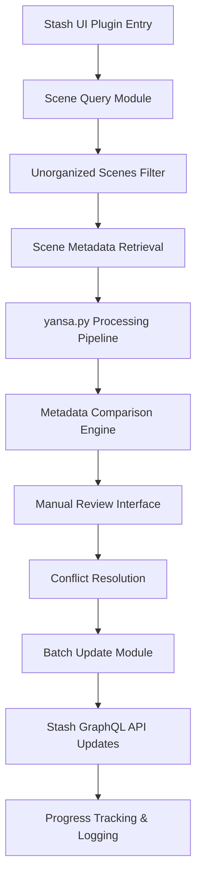

# Stash Integration Architecture Plan

## Overview

This document outlines the architecture for integrating yansa.py with the Stash GraphQL API as a plugin with manual review capabilities. The plugin will query unorganized scenes, process them with yansa.py, and provide a manual review interface before updating metadata.

## System Architecture



## Core Components

### 1. Stash API Client (`modules/stash_client.py`)

**Purpose**: Interface with Stash GraphQL API for scene queries and updates

**Key Features**:
- Authentication using session cookies from plugin input
- Query unorganized scenes with pagination
- Retrieve scene metadata (studio, title, date, code, performers, tags)
- Update scene metadata with parsed results
- Error handling and retry logic

**GraphQL Queries**:
```graphql
query FindUnorganizedScenes($filter: FindFilterType, $scene_filter: SceneFilterType) {
  findScenes(filter: $filter, scene_filter: $scene_filter) {
    count
    scenes {
      id
      title
      date
      code
      studio {
        id
        name
        aliases
      }
      files {
        path
        basename
        parent_folder {
          path
        }
      }
      performers {
        id
        name
        aliases
      }
      tags {
        id
        name
      }
      organized
    }
  }
}
```

### 2. Scene Data Transformer (`modules/scene_transformer.py`)

**Purpose**: Convert Stash scene data to yansa.py input format

**Key Features**:
- Extract file path and basename from scene data
- Handle multiple files per scene
- Preserve existing metadata for comparison
- Create standardized input for yansa.py

**Data Flow**:
```python
# Input: Stash scene object
scene = {
  "id": "8447",
  "title": null,
  "date": null,
  "code": null,
  "studio": null,
  "files": [
    {
      "path": "/media",
      "basename": "(UKNM) - AJ Alexander & Brent Taylor.mp4",
      "parent_folder": {"path": "/media"}
    }
  ]
}

# Output: yansa.py input
filename = "/media/(UKNM) - AJ Alexander & Brent Taylor.mp4"
```

### 3. Metadata Comparison Engine (`modules/metadata_comparator.py`)

**Purpose**: Compare parsed metadata with existing Stash metadata

**Key Features**:
- Field-by-field comparison
- Confidence scoring for matches
- Conflict detection and categorization
- Recommendation engine for resolutions

**Comparison Categories**:
- **No Conflict**: Parsed data matches existing or fills empty fields
- **Minor Conflict**: Small differences (case, formatting, missing details)
- **Major Conflict**: Significant differences (different studio, date, etc.)
- **New Data**: Parsed data where existing is empty

### 4. Plugin UI Controller (`plugin/stash_yansa_plugin.py`)

**Purpose**: Main plugin entry point and UI logic

**Key Features**:
- Plugin registration with Stash
- UI hooks for manual review interface
- Batch processing controls
- Progress tracking and status updates

**Plugin Structure**:
```python
class StashYansaPlugin:
    def __init__(self, stash_interface):
        self.stash = stash_interface
        self.parser = FilenameParser()
        self.transformer = SceneTransformer()
        self.comparator = MetadataComparator()
    
    def main(self, input_data):
        # Plugin entry point
        pass
    
    def get_unorganized_scenes(self, limit=100):
        # Query unorganized scenes
        pass
    
    def process_scenes(self, scene_ids, auto_approve=False):
        # Process selected scenes
        pass
    
    def review_changes(self, scene_comparisons):
        # Generate review interface
        pass
```

### 5. Manual Review Interface (`plugin/ui_components.py`)

**Purpose**: Generate HTML/JSON for Stash UI review interface

**Key Features**:
- Side-by-side comparison view
- Batch approval/rejection controls
- Conflict resolution options
- Preview of changes before applying

**UI Components**:
```javascript
// React-like component structure
const ReviewInterface = {
  SceneCard: {
    original: {...},
    parsed: {...},
    conflicts: [...],
    actions: ['approve', 'reject', 'edit']
  },
  BatchControls: {
    selectAll: boolean,
    approveSelected: function,
    rejectSelected: function
  },
  ProgressBar: {
    current: number,
    total: number,
    status: string
  }
}
```

## Data Flow

### 1. Scene Discovery Phase

1. Plugin queries for unorganized scenes using `organized: false` filter
2. Paginate through results (default 50 scenes per batch)
3. Extract file paths and existing metadata
4. Display list in Stash UI with selection controls

### 2. Processing Phase

1. For each selected scene, extract file path/basename
2. Feed filename to yansa.py parsing pipeline
3. Parse results into structured metadata
4. Compare with existing Stash metadata
5. Categorize conflicts and generate recommendations

### 3. Review Phase

1. Display comparison interface for each scene
2. Show original vs. parsed metadata side-by-side
3. Highlight conflicts with severity indicators
4. Provide options for:
   - Approve all changes
   - Approve individual fields
   - Edit values manually
   - Reject changes

### 4. Update Phase

1. Collect approved changes from review interface
2. Batch update scenes using GraphQL mutations
3. Track progress and handle errors
4. Mark scenes as organized if all metadata is set
5. Log all changes for audit trail

## GraphQL Mutations for Updates

```graphql
mutation SceneUpdate($input: SceneUpdateInput!) {
  sceneUpdate(input: $input) {
    id
    title
    date
    code
    studio {
      id
      name
    }
    organized
  }
}

mutation BulkSceneUpdate($updates: [SceneUpdateInput!]!) {
  bulkSceneUpdate(input: $updates) {
    id
    title
    date
    code
    studio {
      id
      name
    }
    organized
  }
}
```

## Error Handling Strategy

### 1. Network Errors
- Retry with exponential backoff (3 attempts)
- Fallback to smaller batch sizes
- User notification with retry options

### 2. Parsing Errors
- Log filename and error details
- Skip problematic files with user notification
- Provide manual editing option

### 3. Validation Errors
- Check required fields before updates
- Validate studio names against existing studios
- Verify date formats and codes

### 4. Conflict Resolution
- Prioritize existing metadata for major conflicts
- Allow user override for any field
- Track manual overrides in audit log

## Configuration Options

### Plugin Settings
```json
{
  "processing": {
    "batch_size": 50,
    "auto_approve_no_conflicts": true,
    "confidence_threshold": 0.8
  },
  "conflicts": {
    "auto_resolve_minor": true,
    "require_review_major": true,
    "preserve_existing_dates": false
  },
  "ui": {
    "show_preview": true,
    "compact_view": false,
    "sort_by": "filename"
  }
}
```

## File Structure

```
plugin/
├── stash_yansa_plugin.py      # Main plugin entry point
├── ui_components.py          # UI generation logic
├── static/
│   ├── css/
│   │   └── review-ui.css     # Plugin styling
│   └── js/
│       └── review-ui.js      # Frontend interaction logic
└── templates/
    └── review.html           # Review interface template

modules/
├── stash_client.py           # Stash GraphQL API client
├── scene_transformer.py     # Data transformation logic
├── metadata_comparator.py    # Comparison engine
└── batch_processor.py       # Batch update logic

config/
└── plugin_config.json       # Default configuration
```

## Implementation Phases

### Phase 1: Core Integration (Week 1)
- [ ] Implement Stash API client
- [ ] Create scene data transformer
- [ ] Basic yansa.py integration
- [ ] Simple scene query and update

### Phase 2: Comparison Engine (Week 2)
- [ ] Build metadata comparator
- [ ] Implement conflict detection
- [ ] Create recommendation system
- [ ] Add confidence scoring

### Phase 3: UI Integration (Week 3)
- [ ] Develop plugin structure
- [ ] Create review interface
- [ ] Implement batch controls
- [ ] Add progress tracking

### Phase 4: Polish & Testing (Week 4)
- [ ] Error handling完善
- [ ] Performance optimization
- [ ] User testing and feedback
- [ ] Documentation and deployment

## Success Metrics

- **Processing Speed**: < 2 seconds per scene for parsing and comparison
- **Accuracy**: > 90% correct studio identification
- **User Experience**: < 5 clicks to approve batch changes
- **Reliability**: < 1% error rate on updates
- **Coverage**: Process 1000+ scenes in < 30 minutes

## Security Considerations

1. **Input Validation**: Sanitize all user inputs and file paths
2. **Permission Checks**: Verify user has scene edit permissions
3. **Audit Trail**: Log all metadata changes with user attribution
4. **Rate Limiting**: Implement API call throttling
5. **Data Privacy**: No sensitive data logged or transmitted

## Future Enhancements

1. **Machine Learning**: Train models on user-approved changes
2. **Auto-tagging**: Suggest tags based on parsed metadata
3. **Performer Matching**: Integrate performer name parsing
4. **Series Detection**: Identify and group series content
5. **Quality Scoring**: Rate metadata completeness and accuracy